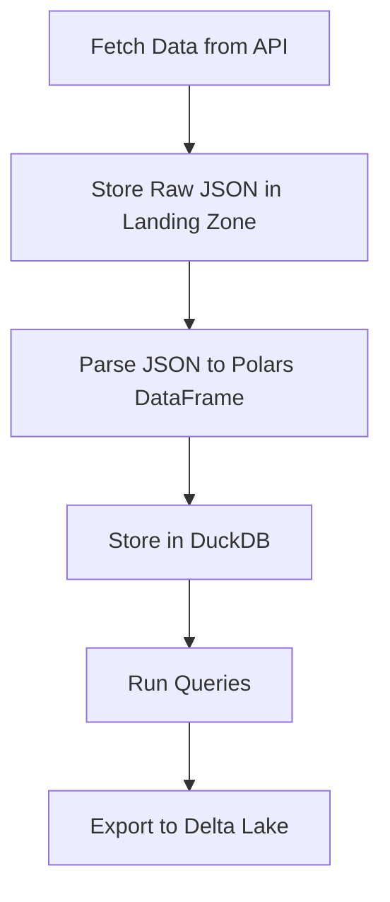

---

### 🏁 **F1 Project** 🏎️


Welcome to the **F1 Project**! This repository is designed to fetch, process, and analyze Formula 1 data using **DuckDB**, **Polars**, and **Delta Lake**.

## 📂 **Project Structure**
```
F1Project/
│── data_pipeline/            # Scripts for fetching and processing data
│── landing_zone/             # Raw API responses
│── processed_data/           # Cleaned & transformed data
│── queries/                  # SQL queries for analysis
│── notebooks/                # Jupyter Notebooks for data exploration
│── main.py                   # Main script to run the project
│── requirements.txt           # Dependencies
│── README.md                  # Project documentation
```

---

## 📌 **Features**
✅ Fetches real-time Formula 1 data from APIs  
✅ Stores data efficiently in **DuckDB**  
✅ Utilizes **Polars** for high-performance DataFrame processing  
✅ Implements **Delta Lake** for versioning and time-traveling  
✅ Supports interactive analysis with **Jupyter Notebooks**  

---

## ⚙️ **Setup Instructions**
### 1️⃣ Clone the repository:
```bash
git clone https://github.com/JoshWardUK/F1Project.git
cd F1Project
```

### 2️⃣ Install dependencies:
```bash
pip install -r requirements.txt
```

### 3️⃣ Run the main script:
```bash
python main.py
```

---

## 📊 **Database & Data Processing Flow**


- **API Data** is stored in `landing_zone/`
- **Polars** is used for **fast** data processing
- **DuckDB** handles database operations 🚀
- **Delta Lake** enables **time travel** ⏳

---

## 🏎️ **How to Query DuckDB from CLI**
Run the DuckDB shell:
```bash
duckdb F1Data.db
```
Example Query:
```sql
SELECT * FROM results WHERE season = '2023';
```

---

## 📅 **Time Traveling with Delta Lake**
Retrieve a specific version:
```python
import deltalake

table = deltalake.DeltaTable("processed_data/f1_results")
df = table.to_pandas(version=3)  # Load version 3
```

---

## 🎯 **Upcoming Features**
- [ ] Automate data updates 📡  
- [ ] Deploy as a web dashboard 📊  
- [ ] Advanced race predictions using ML 🤖  

---

## 🤝 **Contributing**
Want to improve the project?  
✅ Fork the repo  
✅ Create a new branch  
✅ Submit a Pull Request  

---

## 📩 **Contact**
📧 [Josh Ward](https://github.com/JoshWardUK)  

---

### 🚀 *Start Exploring F1 Data Like a Pro!*
Happy coding! 🏁🏎️💨

---

Would you like me to add anything else, like badges or API documentation? 🚀